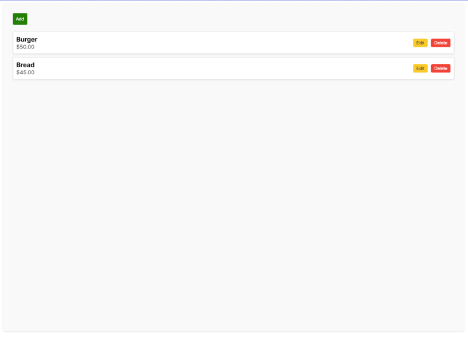
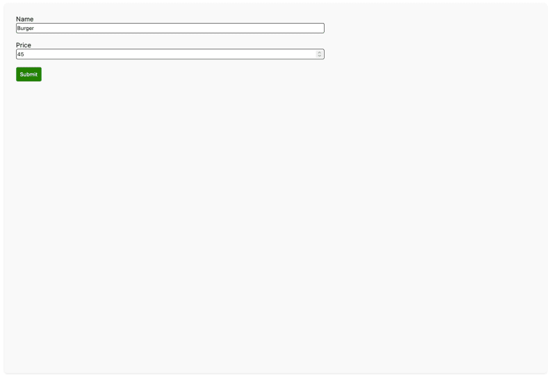

# Integração de Django e Next.js 
- A aplicação é um aplicativo CRUD simples para gerenciar o menu de um restaurante. A partir do frontend, o usuário deve ser capaz de:

    1. listar todos os menus
    2. recuperar um menu
    3. criar um menu
    4. atualizar um menu
    5. excluir um menu

